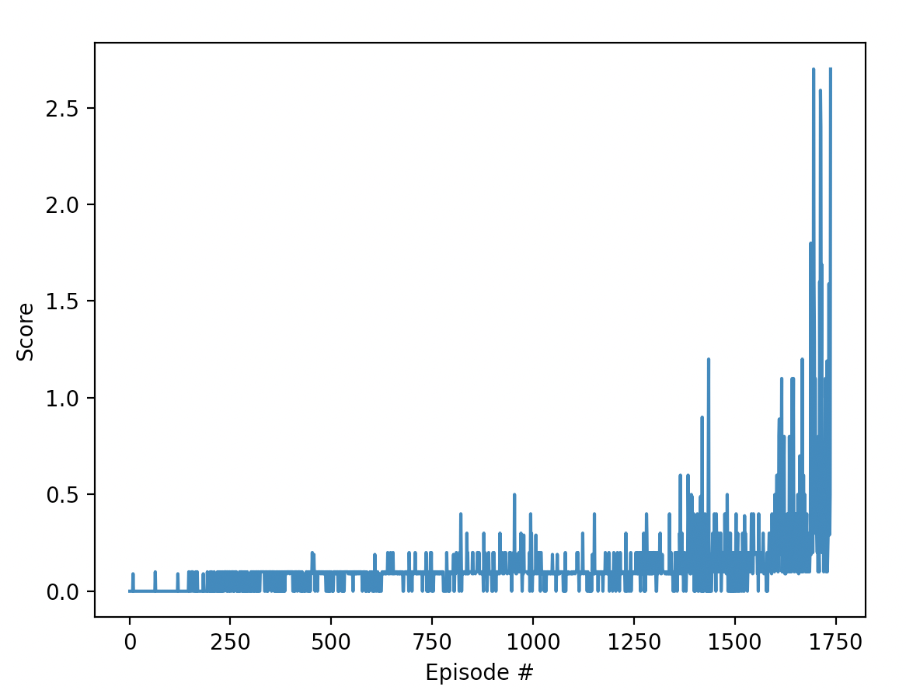

# Project 3: Collaboration and Competition

## Algorithm

The final state of the solution contains the following algorithms:

- Multi Agent Deep Deterministic Policy Gradient (MADDPG)
- Experience Replay (Replay Buffer)

The multi-agent-ddpg instance:
- contains multiple DDPG agents (one for each player)
- contains the *shared* experience replay buffer containing past experience from all agents
- each (internal) DDPG agent has it's own internal neural network (actor and critic)
- the Critic in this case computes the Q value the game state (all agent states), not individually

### Worklog / Details

- I started initially with a simple setup (adapting Project 2: Continuous Control). 

- The were not improving. Scores were zero and the agents seem to learn to always go to the middle of the court.

- I tried tweaking most of the parameters ( a lot of time spent on this ), but without much success.

- Adding noise (Ornstein-Uhlenbeck) with tweaked sigma/theta and a higher initial learning rate for the agent and critic
made the scores non-zero.

- At this point the agent had a "non-zero" behaviour, but not much improvement in time.

- Tweaking the sample batch_size, actor/critic architecture and using a sigmoid as the Critic) made the agent improve. 

- At this point the agent was learning (decently) fast getting to a moving avg of 0.25 fast, but after this the agent
scores dropped quite fast without recovery.

- The solution for this was to use an adaptive learning rate for the optimizers (gamma=0.99 and a step rate of 1000). This decreased the learning rate in time and the agent got to 0.5 ( desired threshold )

- It's worth mentioning all the points above (tweaking parameters) took a lot of time :). I was really happy the first time I saw the agent get to the target.

- More tweaking made the agent learn faster from initially ~8000 episodes to this version that runs in less than 2000.

## Hyperparameters

The main hyperparameters:

* *BUFFER_SIZE* - the agent (experience) memory size measured in entries. The value I used is 10^6. I tried higher values, but the agent was much slower. Values less than 10^6 did not perform well.

* *BATCH_SIZE* - the size of a batch extracted from "Memory". I used a size of 64. Higher values made the agent learn slower. In other problems a higher value performed better. In this one 64 was a good value.

* *GAMMA* - the discount factor, is the discount applied to future events. For this param 0.99 was used.

* *TAU* - the local network parameter contribution ( fraction ) to the target network parameters (set to 0.008)

* *LR* - the initial learnings rate of the networks. For the actor is 0.003, and for the critic 0.0004. This values make the agent learn visibly faster in the first 500 episodes.

* *LR_SCHED_STEP* - trigger a learning-rate decay every 1000 steps

* *LR_SCHED_GAMMA* - learning rate gamma multiplier = 0.9

*OU_NOISE_THETA* - Ornstein-Uhlenbeck Theta - a good value that worked was 0.9

*OU_NOISE_SIGMA* - Ornstein-Uhlenbeck Sigma - good value that worked well was 0.01

## Model Architecture

### Baseline model -

- simple NN architecture for both actor and critic networks 
- 2 hidden layers, first one having 128 units and the second 64 units respectively. 
- ReLu for activation functions 
- the last activation function for Actor is tanh
- the last activation function for Critic is sigmoid interval
- Adam optimizers

### Learning plot

## Conclusion / Future work

* As always, while the steps above improve the agent, a more programatic and organised approach to tweaking hyperparameters and the model would be useful. Most of the tweaking was manual tweaking. 

* As always another improvement would be to tweak the agent to learn even faster.
